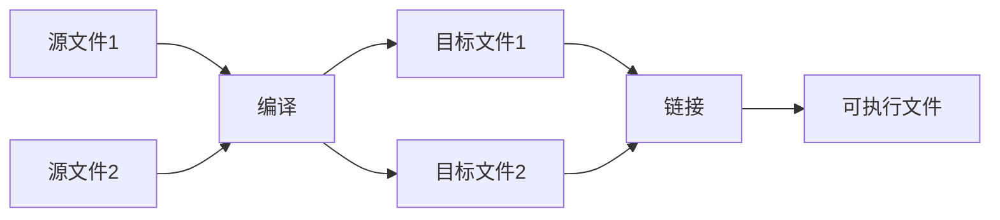

1. CPP编译执行过程



2. 不适用auto的“特殊理由“
   
- 该定义位于一个较大的作用域中，我们希望代码的读者清楚地看到数据类型
- 我们希望明确一个变量的范围和精度（比如希望使用 double 而非 float）

3. 不变性概念

- const: 大致的意思是“我承诺不改变这个值”。主要用于说明接口，使得在用指针和引用将数据传递给函数时就不必担心数据会被改变了。const 值可以在运行时计算
- constexpr: 大致的意思是“在编译时求值”。主要用于说明常量，以允许将数据置于只读内存中（不太可能被破坏）以提升性能。constexpr 值必须由编译器计算

```cpp
// const sum不会更改参数的值
double sum(const vector<double> &);

// 正确：sum(v)在运行时求值
const double s1 = sum(v);
// 错误：sum(v)不是常量表达式
constexpr double s2 = sum(v);


constexpr double square(double x){ return x*x; }
// 正确：1.4*square(17) 常量表达式
constexpr double max1 = 1.4*square(17);
// 错误：var不是常量表达式
constexpr double max1 = 1.4*square(var);
// 正确：可在运行时求值
const double max1 = 1.4*square(var);
```