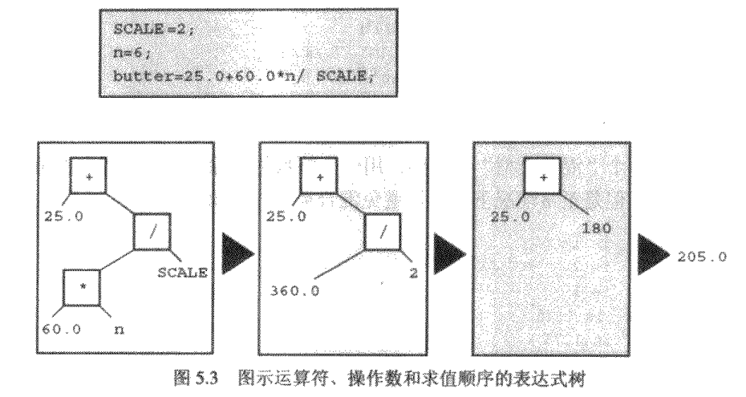

1. 诸多整数类型如何选择

- 目前一般的情况是，long long类型为64位，long类型为32位，short类型为16位，int类型为16位或32位（依机器的自然字大小而定）
- C仅保证short类型不会比int类型长，long类型不会比int类型短
- 首先考虑unsigned类型，此时不需要负数，而且无符号类型可以取得比有符号更大的整数
- 当使用int类型不能表示一个数而是用long类型可以做到时，使用long类型。但是使用long类型会减慢计算，所以没必要时不要使用long类型
- 如果在long类型等于int类型的系统中编写代码，当确实需要32位整数时，应使用long类型（而不是int类型），以便使程序被移植到15位机器上后仍然可以正常工作
- 如果需要64位整数，应使用long long类型
- 在int为32位的系统上，如果需要16位的值，那么使用short类型可以节省存储空间。使用short类型的另一个原因是计算机中的一些硬件寄存器是16位的
- int类型被认为是计算机处理起来最方便有效的整数类型，所以在short类型和int类型长度不同的系统中，使用int类型值进行参数传递的速度更快
- 技术实现上char是整数类型，这是因为char类型实际存储的是整数而不是字符。


2. scanf gets

- scanf() 开始读取输入以后，会在遇到的第一个空白字符空格（blank）、制表符（tab）或者换行符（newline）处停止读取。scanf()只会把一个单词而不是整个语句作为字符串读取
- scanf 读取某种基本变量类型的值，请在变量名之前加上一个&
- scanf 把一个字符串读进一个字符数组中，请不要使用&
- scanf 格式字符串中的空格意味着跳过下一个输入项之前的任何空格 scanf("%c",&ch)读取第一个字符  scanf(" %c",&ch) 读取第一个非空白字符
- gets()来处理一个字符串

| scanf转换说明符 | 意义 |
|:----: | :----: |
| %c | 把输入解释成一个字符（不会跳过空白字符） |
| %d | 把输入解释成一个有符号十进制整数 |
| %e %f %g %a | 把输入解释成一个浮点数 |
| %E %F %G %A | 把输入解释成一个浮点数 |
| %i | 把输入解释成一个有符号十进制整数 |
| %o | 把输入解释成一个有符号八进制整数 |
| %p | 把输入解释成一个指针（一个地址） |
| %s | 把输入解释成一个字符串；输入的内容以第一个非空白字符作为开始，并且包含直到下一个空白字符的全部字符 |
| %u | 把输入解释成一个无符号十进制整数 |
| %x %X | 把输入解释成有符号十六进制帧数 |

3. sizeof 

- 是否使用圆括号取决于是想获取一个类型的大小还是想获取某个具体量的大小。圆括号对于类型是必须的，而对于具体量则是可选的。在所有情况下都是用圆括号会更好

4. prinf

| 转换说明 | 输出 |
|:----: | :----: |
| %a | 浮点数、十六进制数字和p计数法 |
| %A | 浮点数、十六进制数字和P计数法 |
| %c | 一个字符 |
| %d | 有符号十进制整数 |
| %e | 浮点数、e计数法 |
| %E | 浮点数、E计数法 |
| %f | 浮点数、十进制计数法 |
| %g | 根据数值不同自动选择%f或%e。%e格式在指数小于-4或者大于等于精度时候使用 |
| %G | 根据数值不同自动选择%f或%E。%E格式在指数小于-4或者大于等于精度时候使用 |
| %i | 有符号十进制整数（与%d相同） |
| %o | 无符号八进制整数 |
| %p | 指针 |
| %s | 字符串 |
| %u | 无符号十进制整数 |
| %x | 使用十六进制数字0f的无符号十六进制整数 |
| %X | 使用十六进制数字0F的无符号十六进制整数 |
| %% | 打印一个百分号 |

| 修饰符 | 意义 |
|:----: | :----: |
| digit(s) | 字符宽度的最小值。如果该字段不能容纳要打印的数或字符串，系统就会使用更宽的字段 %4d |
| .digit(s) | 精度。对于%、%E和%f转换，是将要在小数点的右边打印的数字的位数。对于%g和%G转换，是有效数字的最大位数。对于%s转换，是将要打印的字符的最大数目。对于整数转换，是将要打印的数字的最小位数；如果必要，要使用前导0来达到这个位数。只使用.表示其后跟随一个零，所以%.f与%.0f相同。 %5.2f打印一个浮点数，字段宽度为5个字符，小数点后有2个数字 |


| 标志 | 意义 |
|:----: | :----: |
| - | 项目是左对齐：也就是说，会把项目打印在字段的左侧开始处 %-20s |
| + | 有符号的值若为正，则显示带加号的符号；若为负，则带减号的符号 %+6.2f |
| (空格) | 有符号的值若为正，则显示时带前导空格（但是不显示符号）；若为负，则带减号的符号。+标志会覆盖空格标志 % 6.2f |
| # | 使用转换说明的可选形式。若为%o形式，则以0开始；若为%x和%x格式，则以0x和0X开始。对于所有的浮点形式，#保证了即使不跟任何数字，也打印一个小数点字符。对于%g和%G格式，它防止尾随零被删除 %#o %#8.0f #+#10.3E |
| 0 | 对于所有的数字格式，用前导零而不是用空格填充字段长度。如果出现-标志或者指定了精度（对于整数）则忽略该标志 %010d %08.3f |

5. 运算符优先级 
> 结合规则适用于共享同一操作数的运算符。12/3*2
> ++ -- 有很高的结合优先级，只有圆括号比他们的优先级高
> 如果一个变量出现在同一个函数的多个参数中时，不要将增量或者减量运算符用于它上面

```c
while (num < 21)
{
// 该程序只在某些系统上正常工作，编译器可以选择先计算函数里哪个参数的值
// 5 25
// 6 30  可能从右往左计算，用5替换最右边一个num，用6替换另外两个num
    printf("%10d %10d\n", num, num*num++);
}
```

> 当一个变量多次出现爱一个表达式里时，不要将增量或者减量运算符用于它上面
```C
n = 3;
// 编译器可能使用n的旧值两次，然后将n增加两次 y=6
// 编译器可能使用n的旧值一次，增加n值一次 y=7
y = n++ + n++;
```
|运算符（优先级递减）|结合性|
|:--:|:--: | 
| () | 从左到右 |
| +-（一元运算符） | 从右到左 |
| */ | 从左到右 |
| +-（二元运算符） | 从左到右 |
| = | 从右到左 |



6. 表达式和语句

- 表达式（expression）是由运算符和操作数组合构成的。每一个C表达式都有一个值

|  表达式   |  值   |
| :-------: | :---: |
|   -4+6    |   2   |
|   c=3+8   |  11   |
|    5>3    |   1   |
| 6+(c=3+8) |  17   |

- 语句（statement）是构造程序的基本成分。程序（Program）是一系列带有某种必须的标点的语句集合。一个语句是一条完整的计算机指令。在C中，语句用结束处的一个分号标识。
- 不是所有完整的指令都是语句

```C
// 只是一个表达式
legs = 4
// 一个语句
legs = 4;

// y=5 是一个完整的指令，但是它只是一个语句的一部分
x = 6 + (y = 5);
```

- 一个序列点（sequence point）是程序执行中的一点；在该点处，所有的副作用都在进入下一步前被计算。在C中，语句里的分号标志了一个序列点。它意味着在一个语句中赋值运算符、增量运算符以及减量运算符所做的全部改变必须在程序进入下一个语句前发生。任何一个完整的表达式的结束也是一个序列点。一个完整的表达式：它不是一个更大的表达式的子表达式

```C
// 从C的角度来看，主要目的是对表达式求值，副作用是将变量states的值设置为50
// ++ -- 运算符也有副作用
states = 50;

// 4+x++ 不是一个完整表达式，所以C不能保证在计算子表达式4+x++后立即增加x
// 分号标记了序列点，所以C能保证的是在程序进入后续语句前x将被增加两次
y = (4+x++)+(6+x++);
```
- 逗号是个序列点，表达式从左到右的次序进行计算，逗号左边产生的所有副作用都在程序运行到逗号右边之前生效（也是分隔符）
```C
// 整个逗号表达式的值是右边成员的值
// 11
x=(y=3,(z=++y+2)+5)

// 500
int x = (houseprice = 149, 500);
// 500
int houseprice = (249, 500);
```


#### 问题

1. [why-can-templates-only-be-implemented-in-the-header-file](https://stackoverflow.com/questions/495021/why-can-templates-only-be-implemented-in-the-header-file)

> The only portable way of using templates at the moment is to implement them in header files by using inline functions.

2. this exceeds GitHub's file size limit of 100.00 MB

> remote: error: GH001: Large files detected. You may want to try Git Large File Storage - https://git-lfs.github.com.

```shell

# deb 添加仓库
curl -s https://packagecloud.io/install/repositories/github/git-lfs/script.deb.sh | sudo bash
sudo apt install git-lfs

# set up Git LFS for your user account by running:
git lfs install

# In each Git repository where you want to use Git LFS, select the file types you'd like Git LFS to manage (or directly edit your .gitattributes).
git lfs track "*.psd"

# make sure .gitattributes is tracked
git add .gitattributes

# Just commit and push to GitHub as you normally would
git push 

```